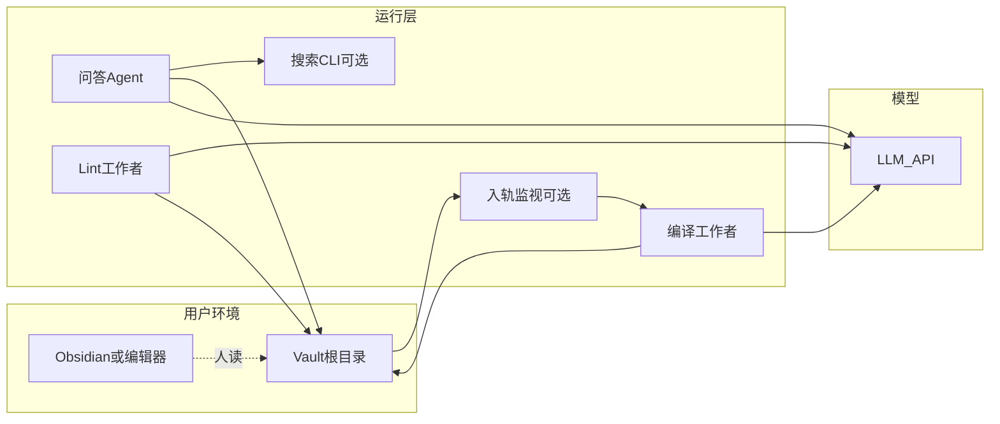

# CRATE 技术方案

| 属性 | 说明 |
|------|------|
| 对应 PRD | [PRD.md](PRD.md) |
| 文档类型 | 技术设计（方案级，非逐步操作手册） |
| 版本 | 0.1 |

---

## 1. 设计目标与原则

1. **本地优先**：vault 即真相源；云端仅模型推理（可配）。
2. **双区存储**：`raw/**` 不可由 LLM 覆盖源文件（默认）；`wiki/**` 由 LLM 主导写入。
3. **可审计**：wiki 页通过 front-matter 指向 `raw` 路径或来源 URL。
4. **渐进检索**：默认 **索引 + 按需读全文**；超阈值再挂 **倒排/向量**。
5. **任务幂等**：重复编译应可收敛；需 prompt 与 token 预算避免无限扩写。

---

## 2. 系统架构概览



**组件职责简述**

| 组件 | 职责 |
|------|------|
| **IngestWatcher（入轨监视）** | 监视 `raw/` 变更（防抖），投递编译任务 |
| **CompileWorker（编译）** | 输入：变更清单 + 现有 wiki 摘要；输出：补丁或整文件写入 `wiki/` |
| **Q&A Agent** | 工具调用：读文件、搜索、写输出；遵守路径 ACL |
| **LintWorker** | 规则引擎 + 可选 LLM 语义巡检 |
| **Search** | 倒排索引（Tantivy/ripgrep 封装）或 BM25；V1+ 向量 |

---

## 3. 目录与数据模型

### 3.1 推荐 Vault 布局

```text
vault/
  raw/                    # 原始材料（用户/剪藏写入）
    papers/
    web-clips/
    assets/images/
  wiki/                   # LLM 编译区
    _index/
      TOPICS.md           # 主题入口
      RECENT.md           # 最近变更（ask 回流）
      LOG.md              # append-only 活动时间线（可选钩子）
      CATALOG.md          # 全文录式目录（--wiki-graph 且有概念页时生成）
    concepts/             # 概念词条
    notes/                # 长文/综述
    outputs/              # 问答产出（可回流）
  meta/                   # 可选：构建状态
    compile_state.json
    wiki_index.json       # 多页编译（--wiki-graph）机器可读索引
    wiki_body_graph.json  # 正文内 wikilink 有向图（crate wiki graph）
    raw_wiki_coverage.json  # raw→wiki 覆盖扫描（crate report raw-wiki）
    wiki_index_extended.json  # wiki/notes/ 标题索引（crate wiki index-extend）
    embeddings.sqlite     # 向量块（crate index）
    lint_last_report.md
  AGENTS.md               # 可选：面向编码 Agent 的项目说明
```

**聊天与嵌入**：`compile` / `ask` / `wiki-check` 与 **`crate index`** 分别使用 **OpenAI 兼容** 的 HTTPS 客户端；服务商、密钥与模型名见 **[providers.md](providers.md)**（`CRATE_LLM_PROVIDER`、`CRATE_EMBEDDING_*` 等）。

### 3.2 Markdown Front-matter（约定）

**Wiki 页示例**

```yaml
---
title: "Attention Is All You Need — 摘要"
sources:
  - path: raw/papers/1706.03762.md
    kind: paper
concepts: [transformer, self-attention]
updated: 2026-04-03
compile_run_id: cr-20260403-01
---
```

**输出页示例**

```yaml
---
title: "多尺度注意力对比笔记"
kind: qa_output
source_query: "对比 Performer 与 FlashAttention 的适用场景"
created: 2026-04-03T12:00:00Z
model: "..."   # 可选
---
```

### 3.3 链接与双向链接

- 支持 `[[concept/slug]]`（Obsidian）与 `[text](wiki/concepts/slug.md)` 并存时，**编译任务**负责规范化（二选一为主）。
- **Lint** 维护「期望值」：每个 `raw` 至少被一个 wiki 页 `sources` 引用（可配置豁免）。

---

## 4. 核心流程

### 4.1 增量编译（Compile）

**输入**

- `delta_raw_paths`：变更文件列表（相对 `raw/`）
- `wiki_manifest`：`TOPICS.md` + 相关概念列表（可先粗检索）
- `policy`：最大新增页数、最大 token、禁止改写路径

**处理步骤（逻辑）**

1. **规划**：模型输出「计划 JSON」：拟新建/更新的 `wiki/**` 路径列表。
2. **读原文**：仅读取 plan 涉及的 raw 与将被更新的 wiki。
3. **生成**：输出 unified diff 或整文件；由运行器校验路径落在 `wiki/`。
4. **提交**：原子写（先 `*.tmp` 再 `rename`）；更新 `meta/compile_state.json`。
5. **索引更新**：刷新 `TOPICS.md` / 反向链接表（可由第二步合并或单独轻量任务）。

**CRATE 实现（增量语义，与 roadmap §7 一致）**

- `meta/compile_state.json` **v2**：`raw_fingerprints` 记录每个 `raw/**` 下 `.md`/`.pdf` 文件内容的 **SHA-256**（非 mtime）。
- **默认增量**：若存在有效 v2 状态，且当前 raw 集合与指纹相比**无新增、无删除、无内容变更**，则**不调模型**、不写新笔记（跳过）。
- **仅新增或修改**：只把**变更过的** raw 文件内容拼进提示（子集编译）。
- **删除 raw**：状态中仍记有已删路径；磁盘上已不存在该文件时，视为库收缩，**用当前全部剩余 raw** 作为一次编译输入并刷新指纹（避免 wiki 仍综述已删材料）。
- **全量**：`--full` / `--no-incremental`，或尚无有效 v2 状态时，使用**当前全部** raw。

**失败与回滚**：保留上一版 `compile_run_id`；失败不写半篇。

**多页 wiki（`compile --wiki-graph`）**

- 与单条 `wiki/notes/compile-*.md` 共用同一套增量 raw 选择与 `meta/compile_state.json` 指纹。
- 模型在 system 中嵌入 [`prompts/wiki_multi.md`](../prompts/wiki_multi.md)，**用户消息**仍为各 raw 文件拼接（与默认 compile 相同）。
- 期望输出为 **单一 JSON 对象**（或 fenced ` ```json ` 块），字段见提示中的 schema：`version`、`concepts[]`（`slug`、`title`、`body`、`sources`）、可选 `synthesis_note`、`topics_markdown`。
- **写入**：每个概念页先写 `*.md.tmp` 再 `os.replace`；`meta/wiki_index.json` 同样原子写。解析失败时只写一条 fallback 编译笔记（`wiki_graph_fallback: true`），stderr 告警。
- **`meta/wiki_index.json`**：`version`、`generated`、`model`、`compile_stamp`、`raw_sources`（本轮编译涉及的 raw 相对路径）、`concepts`（`slug`、`path`、`title`、`sources`）。供后续语义巡检、脚本或 Agent 消费；人类可读主题入口仍以 `wiki/_index/TOPICS.md` 为主（可由 `topics_markdown` 自动生成摘要版）。

### 4.2 问答（Q&A Agent）

**工具集（最小）**

| 工具 | 说明 |
|------|------|
| `vault.read` | 读 `wiki`/`raw` 下文件，限长与 MIME |
| `vault.search` | 调用 Search CLI 或 ripgrep |
| `vault.write_output` | 仅 `wiki/outputs/**` |
| `wiki.apply_patch` | 可选：显式允许时修改单页 |

**上下文策略（分层）**

1. 始终注入：**短系统提示** + `TOPICS.md` 摘要 + 用户问题。
2. **第一轮**：模型决定读取哪些 `concepts/*.md` / `notes/*`。
3. **后续轮次**：工具结果回填；控制窗口：优先摘要文件再全文。
4. **超窗口**：触发「检索工具」或拆分子问题（产品策略）。

### 4.3 Lint

**确定性规则（不调用模型）**

- 断链：`[[...]]` 与 markdown 链接目标存在性
- **入链孤儿**（`crate lint --orphans`）：在 `wiki/**/*.md` 上由正文内 Markdown 链接与 wikilink（**跳过** fenced code）构建有向图；报告**没有任何其他 wiki 页指向**的页面。默认排除 `wiki/_index/INDEX.md`、`TOPICS.md`、`RECENT.md`、`BACKLINKS.md`、`BODYGRAPH.md` 与整个 `wiki/outputs/`（导航/产出区）；**`--include-ephemeral`** 时含 `wiki/_ephemeral/**`。
- **外链 HTTP**（可选）：**`lint --http-external`** 对正文中的 `http(s)://` 做可达性抽检；可用 **`SKIP_HTTP_LINT`** 等在 CI 中跳过。
- （规划中）`raw` 未被任何概念页 `sources` 引用等规则可另行配置

**LLM 增强（可选、贵）**

- 摘要与 raw **事实冲突**抽样检测（仅对高风险页）
- 术语表一致性（同一概念多页定义冲突）

### 4.4 回流

- `wiki/outputs/**` 默认 **不**自动并入 `concepts/`；提供命令 `promote_output_to_note` 由用户或 Agent 显式执行。
- **人类可读**：`ask` 默认在 `wiki/_index/RECENT.md` 追加一行指向问答产出；**append-only 时间线**另写入 `wiki/_index/LOG.md`（`compile` / `ask` 回流 / `wiki-check` 成功时各一行，可用 `CRATE_NO_ACTIVITY_LOG=1` 关闭）。

---

## 5. 检索与规模门闸

### 5.1 阈值（可配置）

| 信号 | 建议默认 | 动作 |
|------|----------|------|
| `wiki` 总词数 | 400k words | 提示启用 BM25 |
| 文件数 | 500 | 分层索引 + 按主题 shard |
| 单次问答工具读总字节 | 2MB | 强制走 search 摘要 |

### 5.2 朴素搜索 CLI（FR-09）

- 输入：`vault_root`, `q`, `top_k`
- 输出：JSON 行：`path, line_no, snippet, score`
- 实现：**ripgrep** 封装或 **Tantivy**；禁止任意 shell 注入。

### 5.3 向量层（V1+）

- 分块单位：**标题分块** + 重叠窗口；`chunk_id` 回链到 `path#Lxx`。
- 与 **wiki-first** 共存：向量检索 **补充** 工具读，不替代 `sources` 审计链。

---

## 6. 与 Obsidian 的集成

- vault 根可直接用 Obsidian 打开：**无需插件**即可读。
- **可选插件**：Marp、Dataview（若用 front-matter 查询）。
- **冲突**：Obsidian 同步服务与 Git 同时使用时，需文档说明「单一同步源」。

---

## 7. 安全

| 面 | 措施 |
|----|------|
| **路径遍历** | 所有路径 `canonicalize` 后须在 vault 根下 |
| **命令执行** | 默认关闭 Agent Bash；仅白名单 CLI（search） |
| **秘钥** | 环境变量 / OS keychain；禁止写入 wiki |
| **剪藏 URL** | 记录于 front-matter；不执行远程脚本 |

---

## 8. 可观测性与运维

- **结构化日志**：`run_id`、`latency`、`tokens`、`exit_code`
- **成本**：按 `compile_run_id` / `qa_session_id` 聚合 token
- **artifact**：每次编译产出 `meta/reports/cr-*.json`（变更文件列表）

---

## 9. 技术栈建议（非强制）

| 层 | 选项 |
|----|------|
| Agent 运行时 | Python（LangGraph / 自研循环）或 TypeScript（与现有工具链一致） |
| LLM | Anthropic / OpenAI / 兼容接口 |
| 搜索 | ripgrep → Tantivy |
| 向量 | sqlite-vss / chroma 本地（V1+） |

---

## 10. 「短命维基」扩展（对应 PRD V2）

**思路**：为单次会话创建 `wiki/_ephemeral/{session_id}/`，多轮编译与 Lint 仅在子树进行；结束后 **打包** 为单份 `outputs/FINAL_REPORT.md` 并可选删除子树。

**要求**：存储配额、自动清理 TTL、与主 wiki 的 promote 规则。

---

## 11. 开放问题

1. **wiki 版本化粒度**：文件级 Git 是否足够，是否需要页内因段落 blame。
2. **多语言 raw**：统一编译语言还是分 vault locale。
3. **图片 OCR**：是否作为 ingest 管道一环。
4. **合规场景**：金融/医疗是否 **禁止** LLM 写 wiki 仅允许辅助检索。

---

## 12. 文档索引

- PRD：[PRD.md](PRD.md)
- 本索引：[README.md](README.md)
